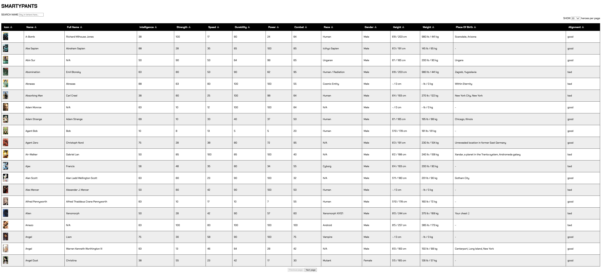

# Smartypants
# Sortable || Superhero Data Organizer

## Overview
This project is a web application that organizes and displays superhero data. It allows users to view, search, and sort information about various superheroes.

## Features
- Fetches superhero data from an API
- Displays superhero information in a table format
- Allows pagination with selectable page sizes (10, 20, 50, 100, or all results)
- Provides an interactive search functionality to filter heroes by name
- Enables sorting of data by clicking on column headers
- Handles missing values in sorting

## Technologies Used
- HTML
- CSS
- Vanilla JavaScript

## API Used
This project uses the Superhero API:
https://rawcdn.githack.com/akabab/superhero-api/0.2.0/api/all.json

## Project Structure
- index.html: Main HTML file
- styles.css: CSS styles for the application
- script.js: JavaScript file containing all the logic


## Getting Started
1. Clone the repository:

```
git clone https://01.gritlab.ax/git/isaavuor/sortable
```
2. Open the index.html file in your web browser.

## Usage
1. Use the dropdown menu to select the number of heroes displayed per page.

2. Type in the search bar to filter heroes by name.

3. Click on column headers to sort the data.

4. Use the pagination buttons to navigate through the results.

## Collaborators
 - Inka Säävuori
 - Jedi Reston
 - Mayuree Reunsati


